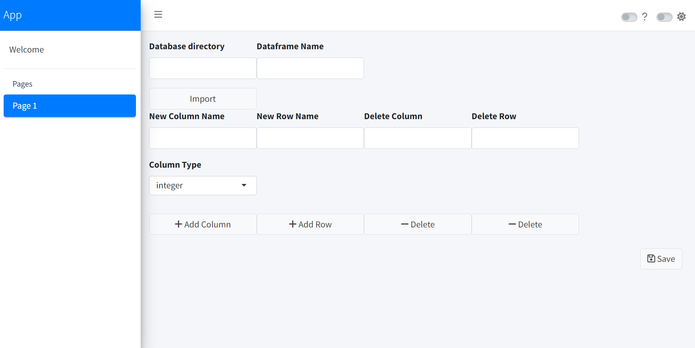

# Shiny App

With this basic app you can manipulate your mini datasets that are
embedded into your personal sqlite database.

## Necessary Libraries

In order to be able to use this shiny app you have to install certain
packages:

``` r
install.packages("shiny")
install.packages("bs4Dash")
install.packages("RSQLite")
install.packages("rhandsontable")
```

## Usage



First you have to specify the file directory of your sqlite database and
select the dataframe that you would like to play with, then press to
$Import$.

Then on second row, there are some tools you can use: add or remove new
column/row. You have to determine the type of the column, whether
integer or character.

Then, after you finished your adjustments, if you press the $Save$
button, the dataframe will be overwriten in place of the current
dataframe into the database.

In order to use this basic app you just have to run the code below

``` r
runApp("Directory of the app")
```
